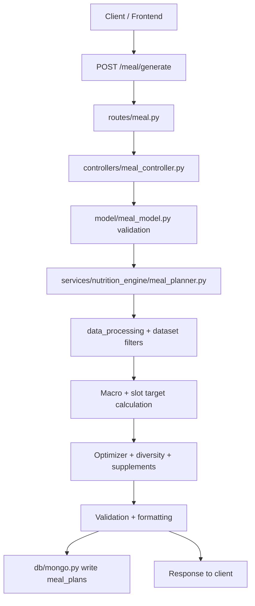
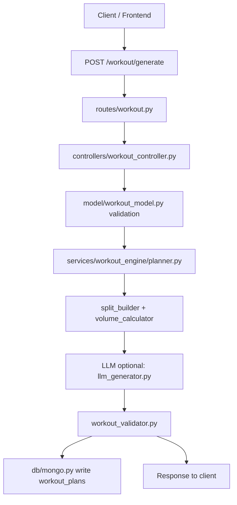
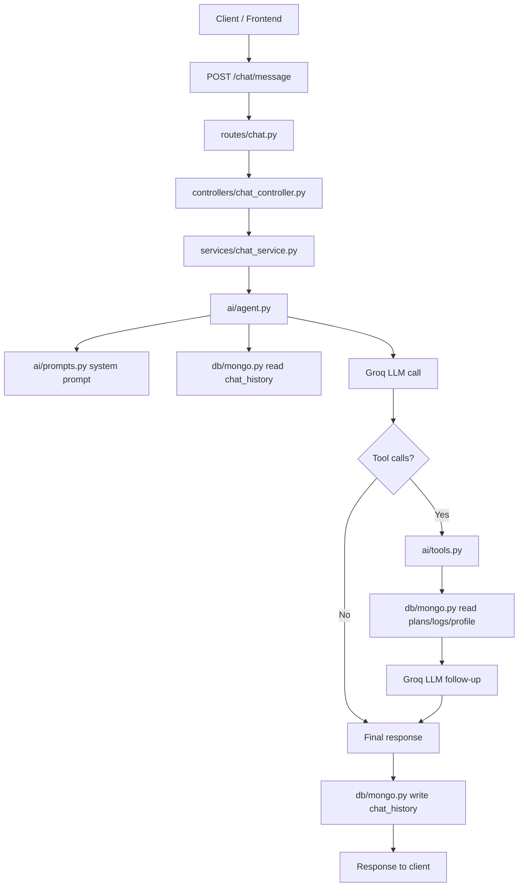
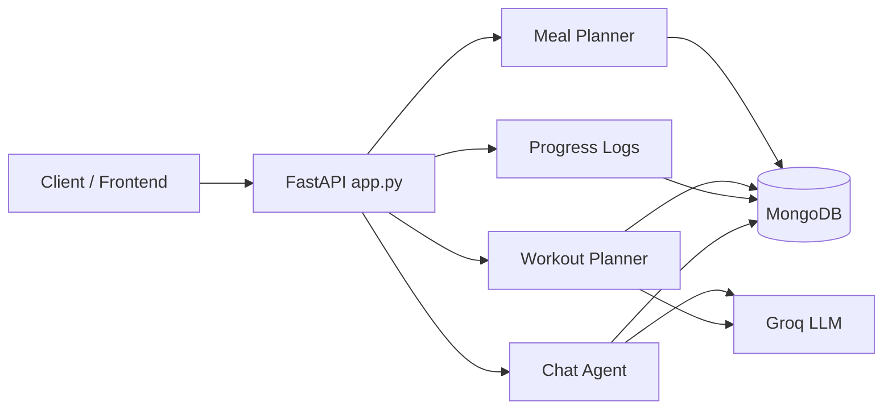

# MetaMeal AI Backend

FastAPI backend for meal planning, workout planning, progress logging, and the AI coach.

## Run Locally

```bash
uvicorn app:app --host 127.0.0.1 --port 8000
```

## Environment Variables (`server/.env`)

```ini
MONGO_URI=mongodb+srv://<user>:<password>@<cluster>/<db>
GROQ_API_KEY=<your_groq_key>
JWT_SECRET=<your_secret>
```

## Main API Flow

1. **Auth** → `/auth/register`, `/auth/login`
2. **Meal Plan** → `/meal/generate` (requires profile payload)
3. **Workout Plan** → `/workout/generate`
4. **Progress Logs** → `/progress/log` and `/progress/{user_id}`
5. **Chatbot** → `/chat/message` (uses Groq tool-calling)

## Curl Examples

### Auth

```bash
curl -X POST http://127.0.0.1:8000/auth/register \
  -H "Content-Type: application/json" \
  -d '{"name":"Test User","email":"test@example.com","password":"TestPass123"}'
```

```bash
curl -X POST http://127.0.0.1:8000/auth/login \
  -H "Content-Type: application/json" \
  -d '{"email":"test@example.com","password":"TestPass123"}'
```

### Meal Plan

```bash
curl -X POST http://127.0.0.1:8000/meal/generate \
  -H "Content-Type: application/json" \
  -H "Authorization: Bearer <TOKEN>" \
  -d '{"age":25,"sex":"male","height":175,"weight":70,"diet_type":"non_veg","activity_level":"lightly_active","goal":"fat_loss","allergies":[],"last_meals":{}}'
```

### Workout Plan

```bash
curl -X POST http://127.0.0.1:8000/workout/generate \
  -H "Content-Type: application/json" \
  -d '{"goal":"muscle_gain","experience_level":"beginner","split":"full_body","training_days":3,"weekly_volume_per_muscle":10,"equipment":"gym","injuries":[],"focus_muscles":[]}'
```

### Progress Logs

```bash
curl -X POST http://127.0.0.1:8000/progress/log \
  -H "Content-Type: application/json" \
  -d '{"user_id":"<USER_ID>","date":"2026-05-25","weight":72.4,"consumed_calories":1850,"notes":"Felt good today"}'
```

```bash
curl http://127.0.0.1:8000/progress/<USER_ID>
```

### Chatbot

```bash
curl -X POST http://127.0.0.1:8000/chat/message \
  -H "Content-Type: application/json" \
  -H "Authorization: Bearer <TOKEN>" \
  -d '{"message":"What is my meal plan today?"}'
```

## Docker Deployment

```bash
docker build -t nutrition-api .
docker tag nutrition-api a3km/nutrition-api:latest
docker push a3km/nutrition-api:latest
```

```bash
docker run -d --name fitness-backend -p 8000:8000 --env-file .env nutrition-api
```

## End-to-End Workflows (Visual)

### Meal Planner Flow



### Workout Planner Flow



### Chatbot (Agent) Flow



## Server-Side File Responsibilities

### App Entry and Configuration

- app.py: FastAPI app setup, middleware, router registration, health check.
- config.py: Centralized configuration loading (Mongo URI, DB name, secrets).
- db/mongo.py: MongoDB client init, collections, health ping.

### API Routing Layer

- routes/auth.py: Auth endpoints routing.
- routes/meal.py: Meal planner endpoints routing.
- routes/workout.py: Workout planner endpoints routing.
- routes/progress.py: Progress logging endpoints routing.
- routes/sync.py: Sync endpoints routing.
- routes/chat.py: Chatbot endpoints routing.

### Controllers (Request Orchestration)

- controllers/auth_controller.py: Auth requests, user registration/login orchestration.
- controllers/meal_controller.py: Normalizes input, invokes meal planner, persists history.
- controllers/workout_controller.py: Normalizes input, invokes workout planner, handles validation errors.
- controllers/progress_controller.py: Progress log create/read logic.
- controllers/sync_controller.py: Sync endpoints orchestration.
- controllers/chat_controller.py: Validates chat payload and routes to chat service.

### Models (Pydantic Validation)

- model/auth_model.py: Auth request/response schemas.
- model/meal_model.py: Meal request schema, enums, constraints.
- model/workout_model.py: Workout request schema, constraints.
- model/progress_model.py: Progress log schema.
- model/chat_model.py: Chat request/response schema.
- model/sync_model.py: Sync request/response schemas.
- model/user_model.py: User domain schema.

### Services - Chat

- services/chat_service.py: Chat service entry, error handling.
- ai/agent.py: Orchestrates LLM calls, tool execution, chat history.
- ai/prompts.py: System prompt and guardrails.
- ai/tools.py: Tool definitions and MongoDB read helpers.
- ai/rag.py: Placeholder for retrieval (currently stub).

### Services - Meal Planning

- services/nutrition_engine/meal_planner.py: Full deterministic meal planner pipeline.
- services/nutrition_engine/metabolic_calculator.py: Calorie and macro target logic.
- services/nutrition_engine/meal_validator.py: Macro and slot validation rules.
- services/nutrition_engine/diet_filter.py: Diet and allergy filters.
- services/nutrition_engine/meal_formatter.py: Response formatting for frontend.

### Services - Workout Planning

- services/workout_engine/planner.py: Main workout planning pipeline.
- services/workout_engine/split_builder.py: Training split and rest day allocation.
- services/workout_engine/volume_calculator.py: Weekly volume distribution per muscle.
- services/workout_engine/llm_generator.py: Groq-based structured generation (optional).
- services/workout_engine/workout_validator.py: Output schema and constraint checks.
- services/workout_engine/workout_formatter.py: Response formatting.

### Progress and Sync

- services/analytics_service.py: Summary and analytics computations.
- services/sync_service.py: Data sync logic and state handling.

### Data and Utilities

- data_processing/: Dataset cleaning and conversion scripts.
- constants/: Static data (indian_food.json, supplements.json).
- utils/helpers.py: Shared helper functions used by services.
- utils/validators.py: Shared validation helpers.

## Quick Notes

- The chatbot and workout planner both use Groq; if GROQ_API_KEY is missing, they fall back or fail depending on the flow.
- The meal planner is fully deterministic and does not require the LLM.

## Architecture Overview (Compact)


